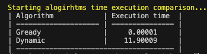

# Algorithms - Homework 9

Було порівняно ефективність жадібного алгоритму та алгоритму динамічного
програмування на прикладі задачі з повернення решти монетами різного номіналу.

У якості вхідних даних було використано:

- досутпні номінали монет - 50, 25, 10, 5, 2, 1
- сумму решти яку треба повернути монетами - 1000000

За допомогою модулю `timeit` було виконано вимірювання часу виконання алгоритмів
у секундах для кожного з алгоритмів на основі 10 повторів.

Результати наведені на зображенні нижче:

## Висновок

Отже, на основі результатів тестових замірів алгоритмів можна зробити висновок,
що жадібний алгорим працює значно швидше. Це можна пояснити наступними
причинами:

- жадібний алгоритм має швидищий час виконання при даних умовах, оскільки він
  при кожному проході вибирає найбільший можливий номінал, який перевищує
  залишок суми. В той самий час, динамічний алгортим додатково обчислює
  мінімальну кількость монет для кожної можливої підсуми
- динамічний алгормти використовує більше памʼяті для збереження проміжних
  результатів для кожної підсуми

Варто зауважити, що за інших умов жадібний алгоритм може призводити до
неоптимального результату, в той час як динамічний алгорити, не дивлячись на
більшу часову складність, завжди дає оптимальний результат. Динамічний алгоритм,
може бути більш ефективним в такій задачі, як "задача про рюкзак", напрклад.
